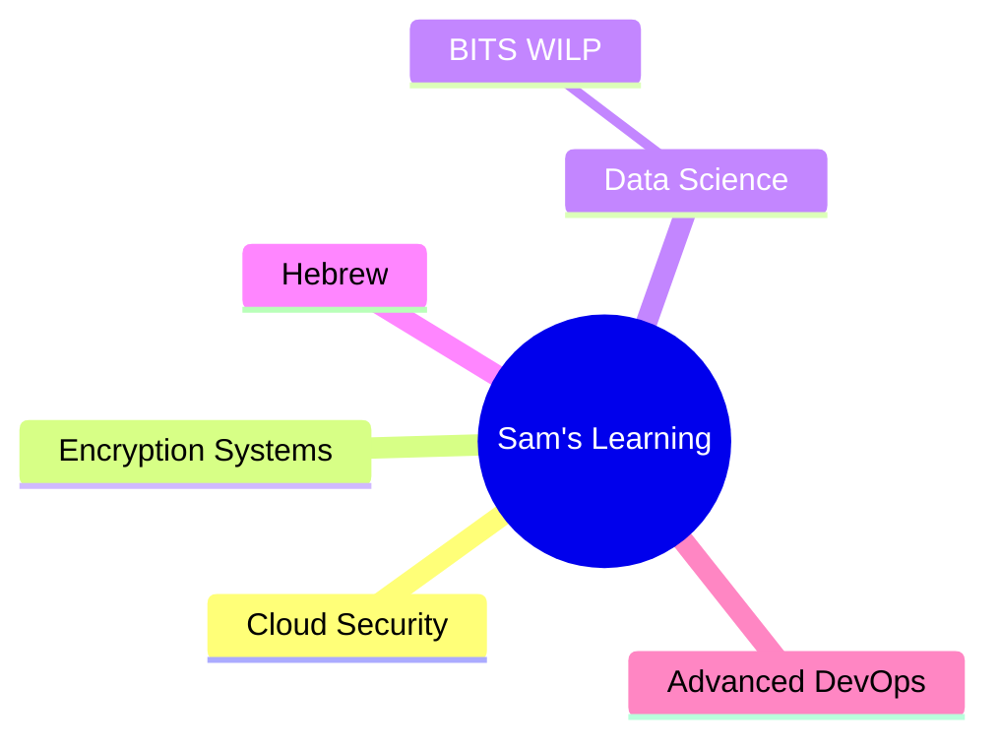

<div align="center">

# 🌐 Sam Tatapudi

### DevOps Engineer • Cloud Security • AI Builder • M.Tech @ BITS Pilani

*A modern, interactive landing-page style README.*  
*Minimal. Aesthetic. Professional. Gen-Z energy without chaos.*

---

</div>

<div align="center">

## 🏠 Home

### _"I build systems, secure them, automate them, and break them only to rebuild better."_

<p align="center">
  
  
  
  
</p>

</div>

---

## 🚀 About Me

I'm **Sam**, a DevOps & Security engineer who loves:

- 🔧 Building cloud-native systems
- 🔐 Securing identity workflows
- ⚙️ Automating anything repeatable
- 🤖 Experimenting with AI & encryption
- 🌅 Waking up at 3 AM like it's a personality trait

Currently pursuing **M.Tech in Computing Science & Infrastructure @ BITS Pilani**.

---

## 🧭 Navigation

<div align="center">

| Jump to Section |
|:---:|
| [👨‍💻 Skills](#-skills) • [🛠 Projects](#-projects) • [📚 Learning](#-learning) |
| [🎛 Interactive Dashboard](#-interactive-dashboard) • [📊 Stats](#-stats) • [⚡ Fun Facts](#-fun-facts) |
| [📬 Contact](#-contact) |

</div>

---

## 👨‍💻 Skills

<table>
<tr>
<td width="33%" valign="top">

### 🛠 DevOps & Infra
- AWS (EC2, VPC, IAM, CloudWatch)
- Docker, Jenkins, GitHub Actions
- CI/CD automation
- Linux & shell scripting

</td>
<td width="33%" valign="top">

### 🔐 Security
- CyberArk
- SAML, SCIM, MFA
- Certificates, RADIUS, EAP-TLS
- Network security

</td>
<td width="33%" valign="top">

### 🧑‍💻 Development
- Python
- FastAPI, Django, Flask
- SQL
- REST APIs

</td>
</tr>
</table>

---

## 🛠 Projects

<details open>
<summary><b>🔐 PhishNet</b></summary>
<br>
A real-time phishing detection Chrome extension.<br>
<b>Tech:</b> JS, security APIs<br>
<b>Status:</b> 🚧 Building
</details>

<details>
<summary><b>🔑 Local Password Vault</b></summary>
<br>
A fully local, encrypted password manager.<br>
<b>Features:</b> MFA, encryption, local-first design
</details>

<details>
<summary><b>📡 Wi-Fi Certificate Authentication</b></summary>
<br>
Enterprise-grade EAP-TLS auth system.<br>
<b>Tech:</b> RADIUS, certificates
</details>

<details>
<summary><b>🤖 WhatsApp → ChatGPT Integration</b></summary>
<br>
Custom bot for automated workflows and AI responses.
</details>

<details>
<summary><b>💻 VS Code AI Extension</b></summary>
<br>
Smart AI-powered workflows inside VS Code.
</details>

---

## 📚 Learning

<div align="center">



</div>

**Currently leveling up in:**
- ☁️ Cloud Security
- 🔐 Encryption systems
- 📊 Data Science (BITS WILP)
- 🗣️ Hebrew
- 🚀 Advanced DevOps patterns

---

## 🎛 Interactive Dashboard

<div align="center">

| Action | Link |
|:---:|:---:|
| 📁 **View Projects** | [](https://github.com/samueltatapudi-dev?tab=repositories) |
| 📧 **Email Me** | [](mailto:your.email@example.com) |
| 👤 **Follow Me** | [](https://github.com/samueltatapudi-dev) |

</div>

---

## 📊 Stats

<div align="center">


</div>

---

## ⚡ Fun Facts

<div align="center">

```yaml
wake_up_time: "03:00 AM"
languages_learning:
  - Hebrew
obsessions:
  - security
  - automation
  - F1
  - theology
building:
  - tools
  - dashboards
  - extensions
  - security apps
known_for: "talking a lot & automating everything"
```

</div>

---

## 📬 Contact

<div align="center">

**GitHub:** [@samueltatapudi-dev](https://github.com/samueltatapudi-dev)  
**Email:** your.email@example.com

---

<sub>Thanks for visiting my landing-page README.</sub>  
<sub>Have a great day — or night — depending on your timezone.</sub>


</div>
